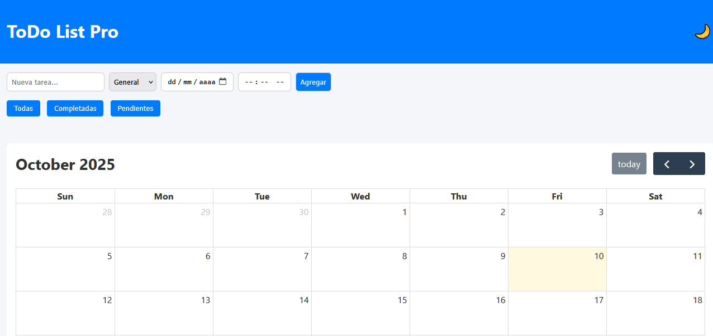
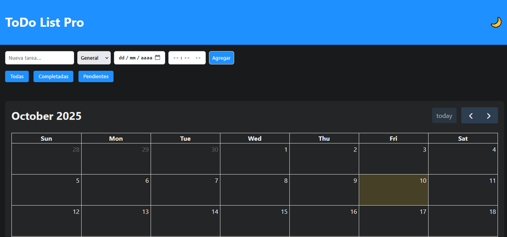

# ✅ ToDo List Pro

Aplicación moderna de lista de tareas con **almacenamiento en LocalStorage**, **modo oscuro**, **filtros avanzados**, **categorías** y un **calendario FullCalendar**.  
Diseñada para ser **responsive** en PC, tablet y móvil, con una interfaz limpia y profesional.

---

## 🚀 Características

- ✍️ Agregar tareas con fecha, hora y categoría.  
- 🔍 Filtros: ver todas, completadas o pendientes.  
- 📂 Categorías: organiza tus tareas en General, Trabajo, Personal.  
- 📅 Calendario FullCalendar integrado para visualización de tareas.  
- 🌙 Modo oscuro persistente guardado en LocalStorage.  
- 🔔 Notificaciones del navegador para recordatorios (requiere fecha y hora).  
- 📱 Diseño responsive adaptable a cualquier dispositivo.  
- 🖱️ Arrastrar y soltar para reordenar tareas.  

---

## 📂 Estructura del proyecto

todo-list/
│
├── index.html        # Página principal
├── css/
│   └── style.css     # Estilos del proyecto
├── js/
│   └── app.js        # Lógica con LocalStorage, filtros, calendario y notificaciones
└── README.md         # Documentación

---

## ⚙️ Instalación y uso

1. Clona el repositorio:

   git clone https://github.com/richie8726/todo-list-.git  
   cd todo-list-

2. Abre el archivo index.html en tu navegador.  

3. (Opcional) Usa Live Server en VS Code para mejor experiencia.

---

## 📸 Capturas de pantalla

---

## 🔔 Notificaciones

Para recibir recordatorios, debes permitir notificaciones en tu navegador.  
Solo funcionan si asignas fecha y hora a la tarea.

---

## 🛠️ Tecnologías utilizadas

HTML5  
CSS3 (responsive + dark mode)  
JavaScript (LocalStorage, DOM, Notifications API, drag & drop)  
FullCalendar

---

## 👨‍💻 Autor

Desarrollado por richie8726 🚀
